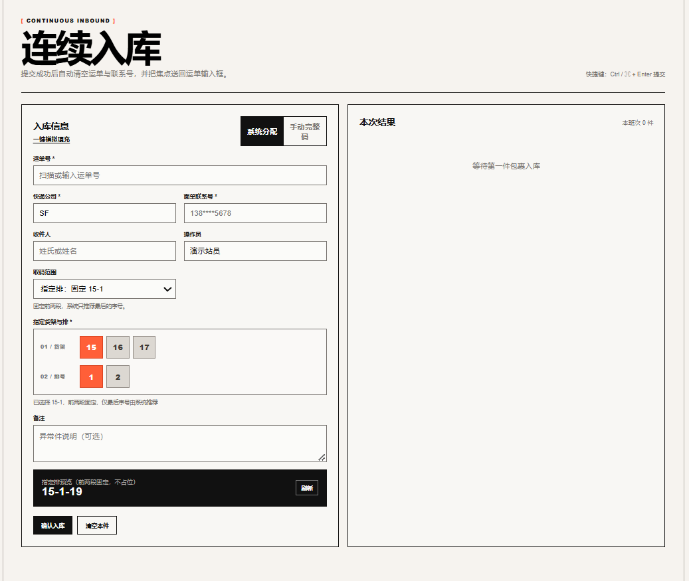
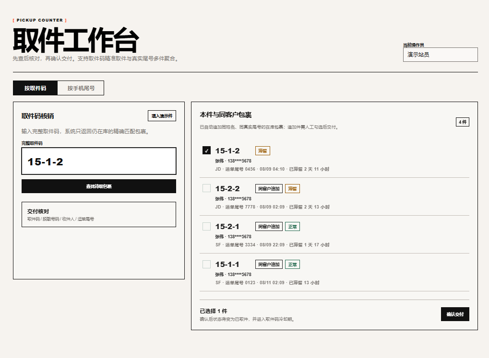
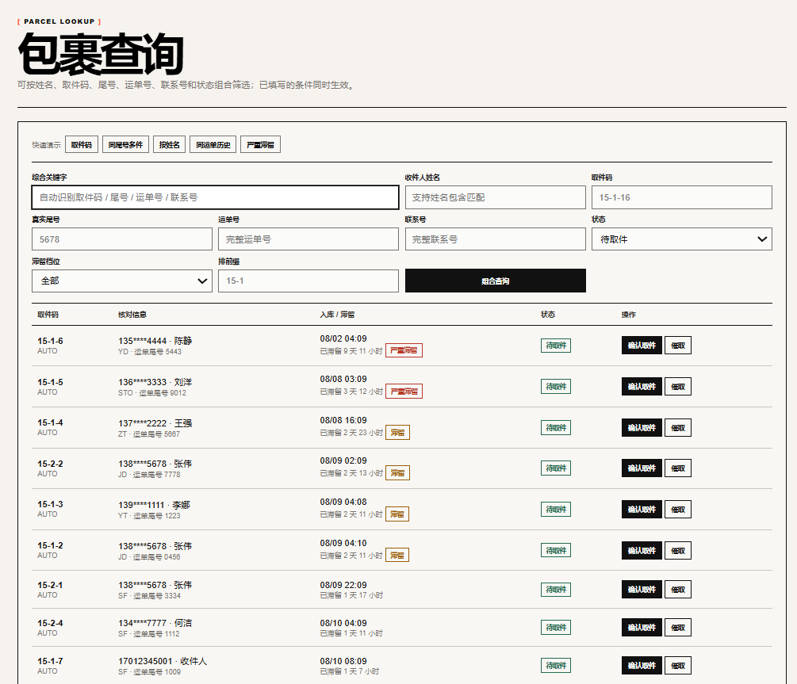
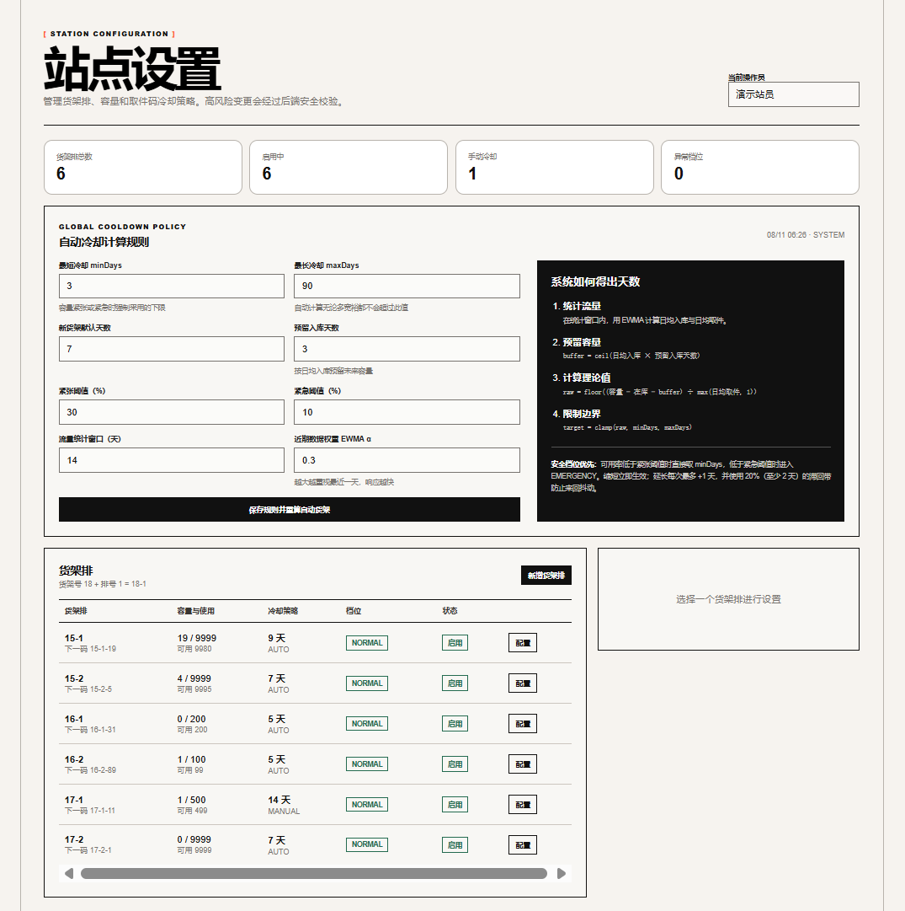

# 末端驿站包裹管理平台

一个面向单站点驿站的包裹管理系统，覆盖连续入库、取件核销、包裹查询、运营看板、
货架配置和取件码冷却管理。项目重点不只是完成增删改查，还处理了取件码循环复用、
隐私面单、并发入库、状态幂等和动态容量安全等实际业务问题。

## 功能概览

### 1. 连续入库

- 支持系统分配和手动完整取件码。
- 系统分配包含三种范围：指定排、指定货架、全站。
- 指定排时通过“货架 → 排号”二级方格选择，选项来自站点当前启用的货架配置。
- 入库前实时预览推荐码；手动码发生占用或冷却冲突时返回明确原因和建议码。
- 提交成功后保留快递公司、操作员和货架选择，只清空本件信息，适合连续扫码作业。
- 本班次结果以栈形式保留，最新一单位于栈顶；撤销操作只作用于栈顶记录。



### 2. 取件工作台

- 支持按完整取件码核销，也可按手机尾号查询待取包裹。
- 自动聚合同一客户的多件包裹，支持勾选后批量交付。
- 展示收件人、脱敏联系方式、快递公司、运单尾号和滞留等级。
- 批量操作逐件返回结果，避免部分失败时把整批请求伪装成全部成功。



### 3. 包裹查询与运营处理

- 支持取件码、姓名、真实尾号、运单号、联系号、状态和货架排组合查询。
- 支持待取件、已取件、退回件等状态筛选，以及正常、滞留、严重滞留分级。
- 可直接完成确认取件、催取、补录真实尾号、备注和异常处理。
- 查询条件组合后同时生效，避免“填写多个条件但实际只使用一个”的歧义。



### 4. 站点与货架设置

- 新增货架排，配置排内容量，并控制是否允许继续分配新包裹。
- 缩容时校验仍被占用的最大序号；存在在库或冷却槽位时禁止直接停用。
- 支持自动冷却和手动冷却，手动值必须通过当前容量压力下的安全上限校验。
- 全局可设置最短/最长冷却天数、默认天数、预留入库天数、统计窗口、
  紧张/紧急阈值和 EWMA 权重。
- 保存全局规则后立即触发自动货架重算，并保留完整决策日志。



### 5. 数据看板

- 展示当日入库、取件、在库、催取和异常统计。
- 按快递公司查看包裹分布。
- 查看每个码空间的容量、在库、冷却、可用率和风险档位。

## 关键设计思路

### 取件码是可循环资源

取件码不是一次性字符串，而是有独立生命周期的货位资源：

```text
可用 → 入库占用 → 取件后冷却 → 冷却结束回炉 → 再次可用
```

包裹取走后，运单生命周期已经结束，但取件码仍处于冷却期。系统分别使用
`active_flag` 和 `code_slot_flag` 表达两条生命周期，并通过数据库唯一索引守住
“活动运单唯一”和“取件码槽位唯一”两条底线。

### 分配范围语义明确

| 范围 | 固定部分 | 系统决定部分 |
| --- | --- | --- |
| 指定排 `ROW` | 货架号、排号 | 最后一段可用序号 |
| 指定货架 `SHELF` | 货架号 | 排号、可用序号 |
| 全站 `FULL` | 无 | 货架、排号、可用序号 |

分配采用 next-fit 搜索，并加载真实占用/冷却位图。并发线程撞到数据库唯一约束后，
会重新读取最新位图并从随机偏移位置重试，避免所有线程锁步争抢同一个序号。

### 状态变化必须幂等且可追溯

确认取件、撤销取件、撤销入库等操作都使用带前置状态的原子更新，例如只允许
`PENDING → PICKED_UP`。更新行数为 0 时重新读取当前状态并返回具体业务错误，
不会把重复请求静默处理成成功。

所有状态变化追加写入 `parcel_event`，冷却策略决策写入
`cooldown_policy_log`，便于还原操作人、时间、指标快照和决策原因。

### 隐私面单与真实尾号分离

系统区分真实手机号、掩码号和 AXB 虚拟号。展示和联系使用面单联系号，
按尾号取件则使用单独的 `real_suffix`。无法从隐私面单得到真实尾号时允许后续补录，
避免把虚拟号后四位误当成客户真实手机尾号。

### 自适应冷却兼顾安全与周转

自动策略基于货架容量、当前在库和近期进出库速度计算：

```text
buffer = ceil(日均入库 × 预留入库天数)
raw    = floor((容量 − 在库 − buffer) / max(日均取件, 1))
target = clamp(raw, minDays, maxDays)
```

可用率跌破紧张或紧急阈值时优先压缩到最短冷却期。容量收紧时一次下调到位；
容量宽裕时每次最多增加 1 天，并使用滞回带避免策略反复抖动。所有参数均可在站点设置中调整。

## 技术栈

| 层次 | 技术 |
| --- | --- |
| 后端 | Java 17、Spring Boot 3.3、Spring MVC、Spring Data JPA |
| 数据库 | MySQL 8.4 / H2，Flyway 管理结构版本 |
| 前端 | 原生 HTML、CSS、JavaScript，由 Spring Boot 直接托管 |
| 接口文档 | Springdoc OpenAPI / Swagger UI |
| 测试 | JUnit 5、MockMvc、H2、可推进的 `MutableClock` |

## 快速启动

### 使用内置 H2

环境要求：JDK 17+、Maven 3.9+。

```bash
mvn spring-boot:run
```

### 使用 MySQL Docker

```bash
docker run --name parcel-station-mysql \
  -e MYSQL_ROOT_PASSWORD=root \
  -e MYSQL_DATABASE=station \
  -p 3306:3306 -d mysql:8.4

mvn spring-boot:run -Dspring-boot.run.profiles=mysql
```

MySQL 连接信息可以通过 `MYSQL_HOST`、`MYSQL_PORT`、`MYSQL_DB`、`MYSQL_USER`、
`MYSQL_PASSWORD` 环境变量覆盖。首次启动时 Flyway 会自动创建表结构。

启动后可访问：

| 页面 | 地址 |
| --- | --- |
| 产品与功能入口 | <http://localhost:8080/> |
| 连续入库 | <http://localhost:8080/inbound.html> |
| 取件工作台 | <http://localhost:8080/pickup.html> |
| 包裹查询 | <http://localhost:8080/query.html> |
| 数据看板 | <http://localhost:8080/dashboard.html> |
| 站点设置 | <http://localhost:8080/settings.html> |
| Swagger UI | <http://localhost:8080/swagger-ui.html> |

## 测试

```bash
mvn test
```

当前共 65 个自动化测试，覆盖取件码归一化、next-fit 分配、自适应冷却、连续入库、
并发冲突、冷却回炉、重复请求、查询、批量取件、撤销以及站点设置安全校验。
时间边界通过注入 `Clock` 和推进 `MutableClock` 验证，不依赖休眠等待。

## 文档

- [需求与实施文档](docs/01-需求与实施文档.md)
- [设计说明](docs/02-设计说明.md)
- [API 文档](docs/03-API.md)
